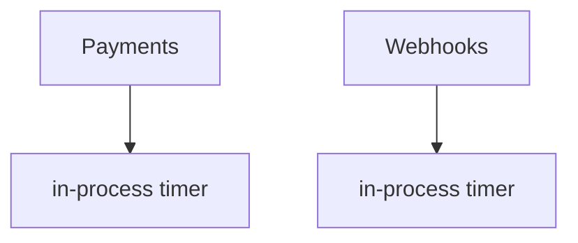

## Summary

Retries are scheduled with in-process timers per consumer; nothing survives
a worker restart today. No shared durable queue exists.

## Answers

### How are retries currently scheduled, persisted, and recovered after a worker restart?

Scheduled via `setTimeout`-style in-process timers (fixture: illustrative,
no real `path:line` citations — this is a hand-written demo).

### What mechanisms already exist for durable queues or scheduled work?

None shared; each consumer rolls its own.

### What idempotency guarantees do today's consumers assume?

None explicit — several are not safe against a duplicate trigger.

## Current architecture

## Existing patterns to reuse

None directly applicable; this is new shared infrastructure.

## Constraints & invariants

Must not duplicate a side effect on redelivery.

## Test landscape

Each consumer has its own retry unit tests; no shared test harness.

## Relevant ADRs

None yet.

## Unknowns

Exact duplicate-rate in production is not measured.

## Open questions
